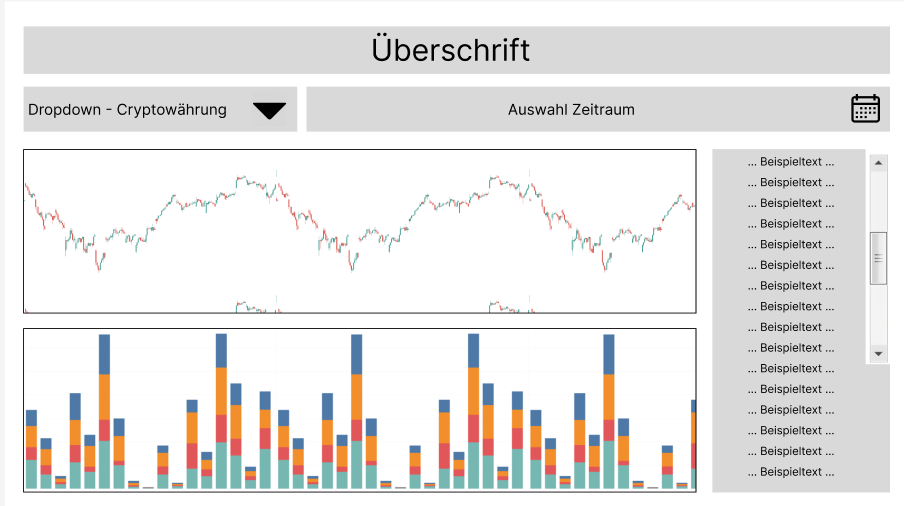

# CrowdFlow

CrowdFlow ist eine Applikation, welche mittels Sentimentanalyse von Blogposts das Stimmungsbild verschiedener Cryptowährungen in definierbaren Zeiträumen klassifiziert und dieses zusammen mit dem jeweiligen Kurs visualisiert. 

Gerade Cryptowährungen besitzen einen starken Zusammenhang zwischen der Stimmung der Investoren und dem Kursverlauf der Währung.

Durch diese Verbindung von Informationsquellen lassen sich Muster besser identifizieren und zukünftige Veränderungen im Kurs mit einem größeren Vertrauen estimieren. 

## Prerequisites
Dieses Projekt wurde in einer Python-3.11.10-Umgebung entwickelt. Die benötigten Pakete können mit folgendem Befehl installiert werden:
```bash
pip install -r "requirements.txt
```

Zusätzlich wird ein vortrainiertes Word2Vec-Modell genutzt dass über folgenden Link heruntergladen werden kann: [GoogleNews-vectors-negative300](https://www.kaggle.com/datasets/adarshsng/googlenewsvectors/data). Dieses muss nach dem Download in den Ordner `res/models` abgelegt werden.

Aufgrund der Dateigröße wurden lediglich die unverarbeiteten Datenästze im Ordner `res/input` abgelegt. Zum Teil werden die Datensätze aber auch erst zur Laufzeit (von Huggingface) heruntergalden und die verarbeitete Version abgespeichert. Bevor die Modelle trainiert und in der Anwendungsoberfläche verwendet werden können, muss das `src/data_preparation.ipynb` Notebook ausgeführt werden. Dieses erstellt die fertig prozssierten Datensätze und legt sie im Ordner `res/prepared` ab. Ist dieser Schritt abgeschlossen, kann in der Datei `src/utils/config.py` der gewünschte Trainings- sowie Cross-Validierungsdatensatz angegeben werden. Hiernach können die verschiedenen Notebooks zum Trainieren und Evaluieren der Modelle ausgeführt werden.

## Konzept

CrowdFlow setzt sich aus den beiden Bestandteilen "Modell" und "Applikation" zusammen. 

### Daten
#### Trainingsdaten

Der für das Training verwendete Datensatz enthält Blog-Posts über Cryptowährungen, inklusive seiner Details wie dem Datum, Titel, Text, Quelle und URL. Dazu kommen zwei Spalten, welche angeben, um welche Cryptowährung sich der Post dreht und welche Stimmung dieser projiziert. Die Stimmung besitzt drei Werte unterteilt in positiv, neutral und negativ.


Für das tatsächliche Training sind lediglich Titel, Text als Prädiktoren und Stimmung als Zielvariable relevant. Auf Basis dessen wird das Modell trainiert und soll hiermit fortlaufend live-data nach ihrem Sentiment klassifizieren können.

#### Live-data

Als live-data werden alle Daten bezeichnet, welche der Applikation auf Abruf von externen Quellen zugefügt werden. Dazu gehören zum einen die Blog-Posts und zum anderen die Kursverläufe der Cryptowährungen.


Die Blog-Posts werden in der Applikation durch das vortrainierte Modell klassifiziert und anschließend in eine Gesamtstimmung aggregiert. Zugehörig zu den Blogposts wird dann der Kursverlauf der Cryptowährung visualisiert, um so eine Verbindung zwischen dem Human-Sentiment und der tatsächlichen Entwicklung der Kryptowährung herzustellen.

### Modell
#### Supervised

Klassifizierungsmodelle wie randomforrest:
- Text wird vektorisiert und tokenisiert (finbert/nltk)
- compound words werden auseinander gezogen

LLMs:
- basic Modelle wie Ollama und ChatGPT
- spezielle vortrainierte Modelle (hugging face)

#### Unsupervised

Clustering:
- tbd

### Anwendungsoberfläche

Die Anwendungsoberfläche bietet dem Nutzer die Möglichkeit eine bestimmte Cryptowährung auszuwählen, dessen Situation dieser analysieren möchte. Diese Wahl kann über das Dropdownmenü in der oberen linken Ecke des UI getroffen werden.

Anschließend kann der Nutzer den gewünschten Zeitraum definieren. Anhand diesen Zautraumes werden die dort entstandenen Blog-Posts an das Modell übergeben, welches diese einzeln klassifiziert und anshcließend eine Gesamtstimmung für jeden Tag des angegebenen Zeitraums aggregiert.

Anhand des Zeitraums wird der offizielle Kurs der gewählten Cryptowährung in einem Kerzendiagramm in der unteren Hälfte der Oberfläche dargestellt. Dabei verkörpert eine Kerze im Kursdiagramm vier Stunden Echtzeit. Somit ergeben sich sechs Kerzen pro Tag. An jeder Kerze wird außerdem die Verteilung des Sentiments der analysierten Blog-Posts dargestellt. Diejenigen Posts, welche zu dem jeweiligen Zeitpunkt veröffentlicht und klassifiziert wurden, werden hier mit einem stacked bar chart dargestellt. Somit ist ein möglichst detailierter Einblick in zeitbezogen aktuelle Stimmungen zu erhalten und diese dem Kursverlauf zuzuordnen.

Der Einblick wird zudem erweitert, indem in einem Fenster an der rechten Seite des Interfaces die analysierten Blockposts angezeigt werden. Hiermit kann sich der Nutzer noch mehr Informationen darüber beschaffen, was die genauen Gründe für positive, neutrale oder negative Stimmungsbilder sind, um diese in die eigene Entscheidungsfindung udn Recherchen einfließen lassen zu können. Hiermit wird dem Nutzer eine weitere Informationsquelle geboten, um das Gesamtbild möglichst vollständig erfassen zu können


